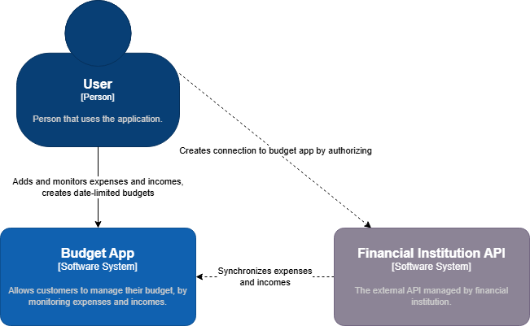
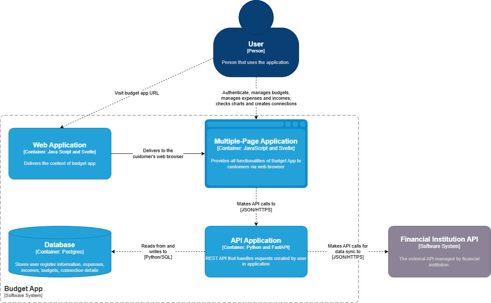
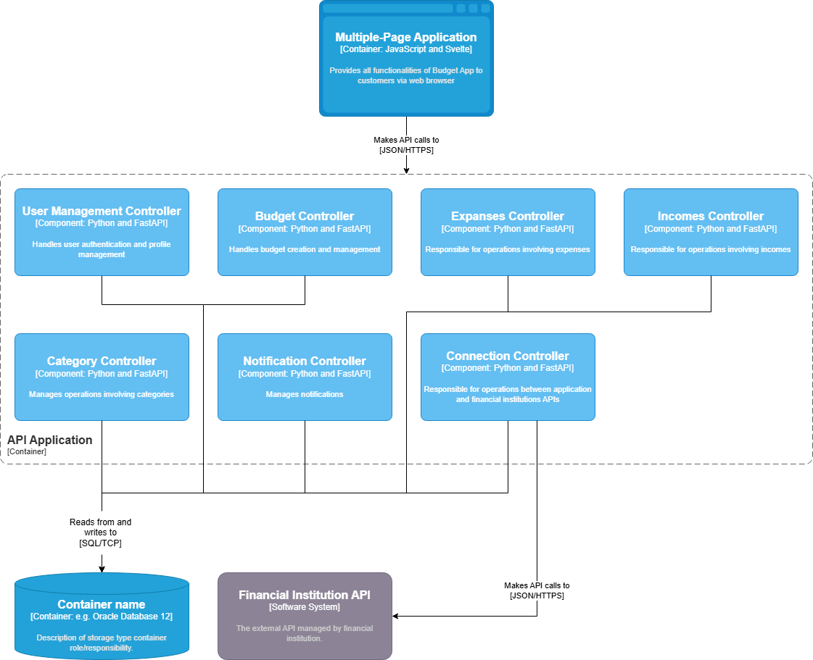

# Budget App
- [Budget App](#budget-app)
  - [General information](#general-information)
    - [System description](#system-description)
    - [Business benefits](#business-benefits)
  - [Stakeholders](#stakeholders)
  - [Actors](#actors)
  - [Objects](#objects)
  - [Context diagram](#context-diagram)
  - [Functional requirements](#functional-requirements)
    - [1. User authentication](#1-user-authentication)
    - [2. Manual management of Incomes and Expenses](#2-manual-management-of-incomes-and-expenses)
    - [3. Automated synchronization with Financial Institutions](#3-automated-synchronization-with-financial-institutions)
    - [4. Visualization](#4-visualization)
    - [5. Budget Management](#5-budget-management)
    - [6. Expenses Categorization](#6-expenses-categorization)
    - [7. Notifications](#7-notifications)
  - [Non-functional requirements](#non-functional-requirements)
    - [Security](#security)
    - [Performance](#performance)
    - [Usability](#usability)
  - [Container Diagram](#container-diagram)
  - [Component Diagram](#component-diagram)
  - [Technology Stack](#technology-stack)

## General information

### System description
Budget App is a application that is designed to empower users in managing their expenses and incomes. Main functionalities are:
- **Account creation:** register and authenticate using email and password to securely access personalized finance tracking
- **Manual data entry:** record income or expenses with summary, amount and transaction date
- **Automated sync:** connected to supported financial institutions to synchronization of income and expenses
- **Visualization:** Generate date-limited charts that provide analysis of income and expenses

### Business benefits
- **Enhanced Financial Awareness:** Users gain comprehensive visibility into their spending patterns and income sources
- **Expense Optimization:** Identification of unnecessary spending allows users to reduce costs and increase savings
- **Improved Decision Making:** Data-driven insights enable better financial planning and resource allocation
- **User Retention:** Regular engagement through budget notifications and financial tracking creates sticky user experience

## Stakeholders
1. **End Users** - Individuals who will use the application to manage their personal finances, including tracking expenses and incomes.
2. **Developers** - Team responsible for creating this application 
3. **Investors** - People that invested their money in development of that application with in order to earn money in case of its success.

## Actors
The Budget App primarily interacts with two main actors: the User and the Financial Institution. This distinction is made to simplify the system's design and focus on the core interactions necessary for managing personal finances.

**User** is a primary actor who interact with application. User has the following attributes:
- email
- password

**Financial Institution** is an actor that interacts with the application to provide automated synchronization of income and expenses. It has the following attributes:
- id - unique identifier of the financial institution
- name - name of the financial institution

## Objects

**Expense** - represents money that user spent on something and was registered in application by user or financial institution sync. It has following attributes:
- id - unique identifier
- summary - a brief description of the expense
- amount - the amount of money spent in transaction
- transaction date - the date when transaction occurred
- category id - reference to existing category (e.g.: food, subscriptions, transportation)
- user id - identifier of the user which registered the expense

**Income** - represents money that user received. It can be registered manually or sync from financial institution. It has following attributes:
- id - unique identifier
- summary - a brief description of the income
- amount - the amount of money received
- transaction date - the date when transaction occurred
- source - income source (person of institution that send money)
- user id - identifier of the user which received money

**Connection** - represents connection to financial institution API service. It's created by user and used to automatically synchronize expenses and incomes. It has following attributes:
- id - unique identifier
- institution name - name of the financial institution 
- api key - api key generated when user authorized connection to financial institution
- status - the current status of connection (active / inactive / error)
- last sync - the timestamp of the last successful synchronization
- user id - identifier of the user which created connection 

**Budget** - represents budget created by the user for the specified time period to manage their expenses within limit. It can be used in notification, if declared limit is exceeded. It has the following attributes:
- id - unique identifier
- amount - the maximum amount of money allocated for specified budget
- period - time period for budget (weekly / monthly / yearly)
- status - the current status (under / exceeded)
- user id - identifier of the user which created budget

**Category** - represents expense category. It has the following attributes:
- id
- name
- user id - identifier of the user which created category

**Notification** - represents a notification send to the user when expenses reach specified budget threshold. It has following attributes:
- id - unique identifier
- budget id - identifier of the budget
- threshold - % of the budget, when exceeded will trigger notification
- status - notification status (pending / send)
- user id - identifier of the user which created notification

## Context diagram

## Functional requirements

### 1. User authentication
As a user, I want to create and manage an account, so that my personal information is securely stored and can't be anyone unauthorized. 

**Acceptance criteria:**
- User can register and login with an email and password.
- Email and hashed password is stored in database.

### 2. Manual management of Incomes and Expenses
As a user, I want to manually enter my income and expenses using simple and intuitive UI, so that I am able to track my finances. 

**Acceptance Criteria:**
- User can create incomes and expenses using a form
    - expense is described by summary, transaction date, amount and category
    - income is described by summary, transaction date, amount and source
- All data is stored inside database
- Data is associated with user that created it 

### 3. Automated synchronization with Financial Institutions
As a user, I want to create connection to financial institution in which I have bank accounts, so my expenses and incomes are automatically registered in application. Multiple connections should be able per user. 

**Acceptance Criteria:**
- User can connect to all financial institutions available in Poland
- Connection should be established using token that is associated to user and generated during connection creation
- Connection should pull all expenses and incomes events from its source

### 4. Visualization
As a user, I want to have a possibility to check date-limited charts to analyze my finances. Those charts should show expense and income comparison, and expenses grouped in categories.

**Acceptance Criteria:**
- Application generate charts based on data stored in database
- User can select a date range for the charts

### 5. Budget Management
As a user, I should be able to create a budget for a specific time period to manage my expenses within some limit. 

**Acceptance Criteria:**
- User can create a budget with an amount, period and status
    - status can be under or exceeded
- System monitors if sum of expenses exceeded defined limit and changes status based on calculations

### 6. Expenses Categorization
As a user who wants to effectively manage my personal finances, I need the ability to categorize my expenses. This feature will allow me to group similar expenses together (e.g., groceries, entertainment, utilities).

**Acceptance Criteria:**
- Users should be able to edit and delete existing categories.
- Users should be able to change the category of an existing expense.
- (Optional) The system may provide a set of pre-defined default categories to help users get started (e.g., Food, Transportation, Bills).

### 7. Notifications
As a user who is actively managing my budget, I need to receive timely notifications when my expenses are approaching or have exceeded a specified percentage of my budget. This will help me stay informed about my spending in real-time and take immediate action to avoid overspending.

**Acceptance Criteria:**
- The system should automatically monitor expenses against the budget.
- When expenses reach or exceed the specified threshold, the system should trigger a notification.

## Non-functional requirements

### Security 
The system must support strong user authentication mechanism to restrict access to user data based on permissions.

As this application holds sensitive data (e.g.: user credentials, which are utilized to connection to external financial institution), it must be encrypted in transit (with HTTPS) and at rest (using AES-256). 

**Acceptance Criteria:**
- Network traffic can be analyzed to verify that data is transferred using HTTPS.
- Database inspection to verify encryption at REST.
- Penetration tests for user authorization verification.

### Performance
System should response to user request within five seconds. Graphs are exceptions to this rule, they should load in ten seconds.

All operations registered in external financial institutions should be synced with application within five minutes.

**Acceptance Criteria:**
- Performance monitoring tools to measure response times.
- Automated tests to measure synchronization times.
- Database query performance analysis.

### Usability
Application shall have a clean and intuitive user interface. It must be responsive to ensure that user can operate it from any device. 

Data entry forms must be clear and provide appropriate input validation. 

**Acceptance Criteria:**
- Usability testing with representative users.

## Container Diagram

## Component Diagram

## Technology Stack
| Technology | Used for | Reason                                                                                                            |
| ---------- | -------- | ----------------------------------------------------------------------------------------------------------------- |
| Python     | Backend  | High-level programming language with extensive libraries and frameworks for web development.                      |
| FastAPI    | Backend  | Modern, fast (high-performance), web framework for building APIs based on standard Python type hints.             |
| JavaScript | Frontend | Versatile language for building interactive user interfaces.                                                      |
| Svelte     | Frontend | Compiler that generates minimal and highly optimized JavaScript code for building user interfaces.                |
| Postgres   | Database | Powerful, open-source object-relational database system with a strong reputation for reliability and performance. |